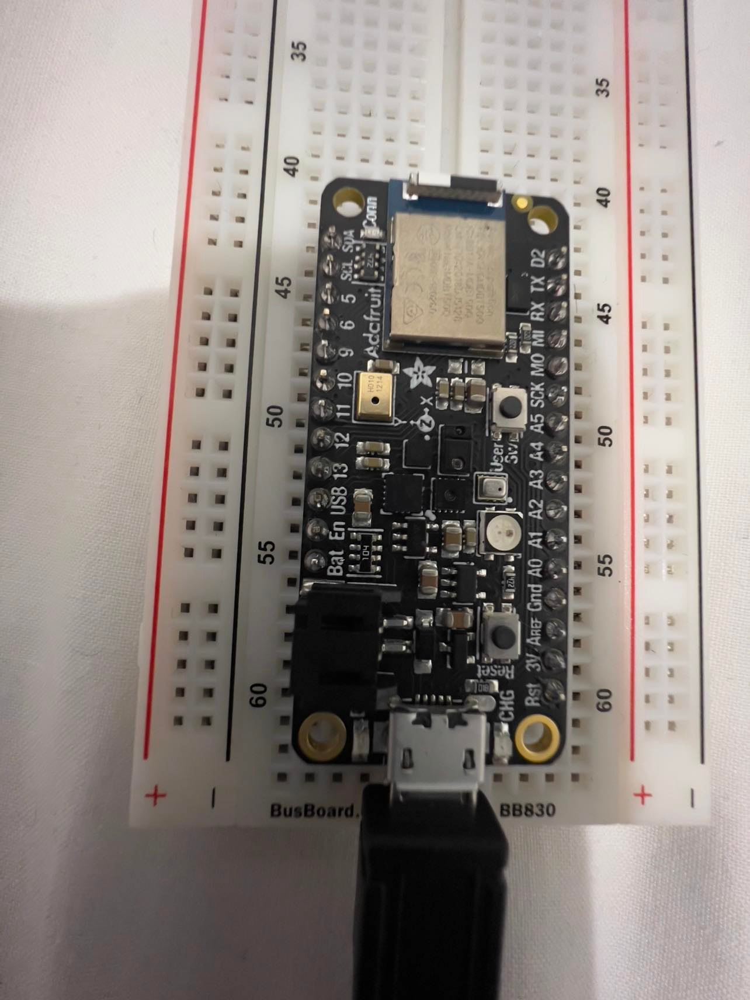
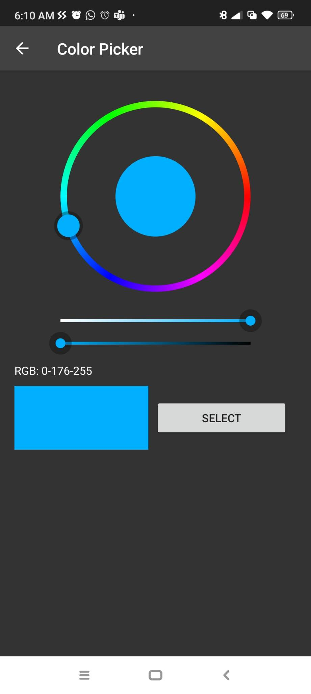
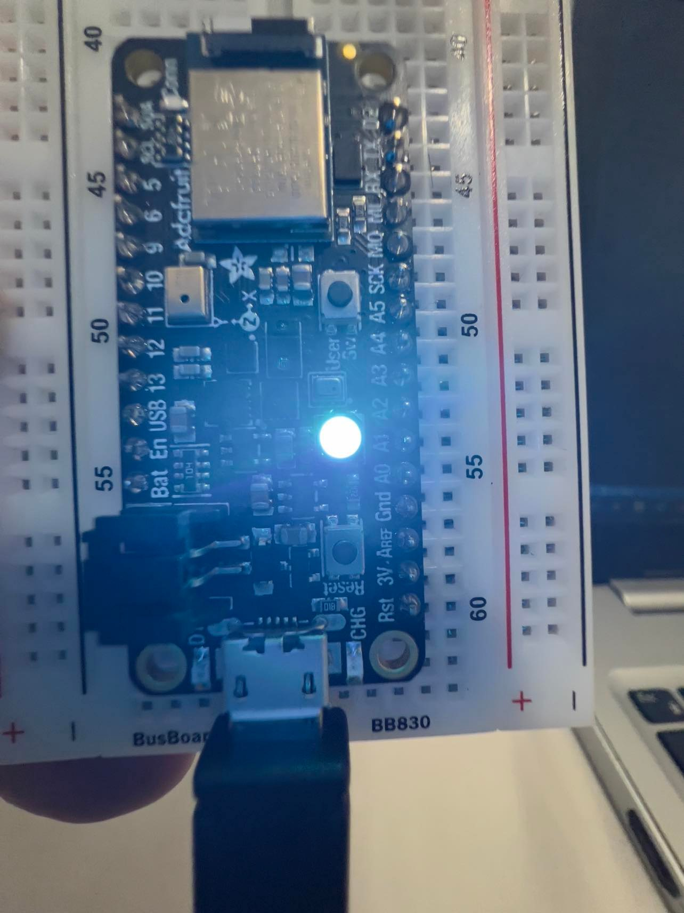

# BLE_Project
Developing a BLE client to access the BLE peripheral.

# GROUP 8
- [TAREQ MD RABIUL HOSSAIN CHY](https://www.linkedin.com/in/tareqmdrabiulhossainchy/)
- [NUSHRAT JAHAN](https://www.linkedin.com/in/nushrat-jahan-3275a9178/)

# Project Description
In this project we used nrf52 and our smartphone. We installed an app "Bluefruit Connect" in out smartphone. Turned on the location and bluetooth connection. In this project we changed the color of the on-board NeoPIxel using CircuitPython and the Bluefruit LE Connect app.

In the code first we import the necessary libraries and instantiate the UART server. Inside the loop, we first begin advertising. Once connected, the board begins listening for packets. In the event that a color packet is received, it changes the color of the NeoPixel to the chosen color. We picked different color from the color pallete and send the color to nrf52 to change the color of NeoPixel.

# Components Used
- 1 nerf52840
- Bluefruit App in smartphone
- 1 USEB cable
- breadboard

We used Visual studio code to run the file.

# Connection
Here we can se the connection 

Figure 1. Circuit connection

Figure 2. Color picking from bluefruit app

Figure 3. Enlightened with color

# References
- [Source](https://learn.adafruit.com/circuitpython-nrf52840/neopixel-color)
- [Bluefruit connection](https://learn.adafruit.com/bluefruit-le-connect)

